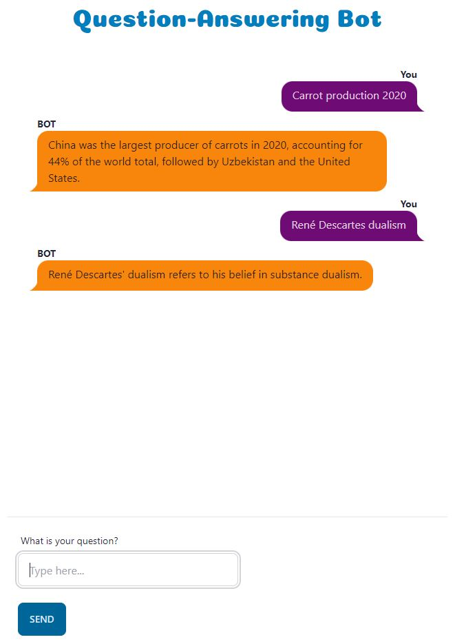

# Question-Answering Bot

**Question-answering bot built with DistilBERT and Django.**

## Workflow Explanation

- User submits a question.
- The system selects the most relevant Wikipedia article.
- It ranks the paragraphs within the article using a semantic search 
with the HyperDB vector database.
- The top-ranked paragraph serves as the context for the DistilBERT model.
- The system receives the response from DistilBERT.
- Finally, it generates a coherent sentence using Chat GPT and sends it back to the user.
